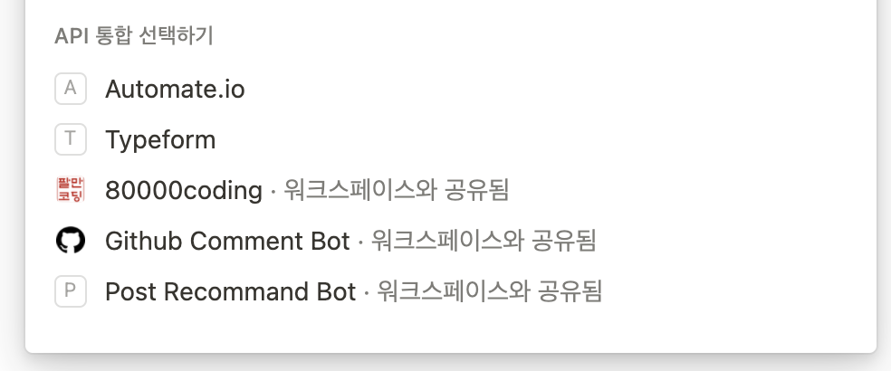

# 80000coding_comment

for utterances

### Usage

1. utterances와 깃허브 레포지토리 연결하기! 아래 app링크에서 댓글을 보관할 github 레포지토리를 연결합니다.

- docs : https://utteranc.es

- app : https://github.com/apps/utterances

2. oopy에 utterances코드 추가하기! 아래 블로그를 참고했습니다.

- blog : https://another-light.tistory.com/90

3. notion api 토큰 발급받기! 아래 링크로 가서 토큰을 발급받습니다!

- https://www.notion.so/my-integrations/internal/d72d563bc5a042a696784ad086559c10

4. 워크스페이스에 토큰 적용하기. 노션 워크스페이스 - 공유 - API통합 이름을 입력해서 추가합니다! 아래와 같이 추가되어야 합니다!
   

5. github action, github secrets 추가하기! 발급받은 토큰은 github secrets에 추가하고 아래의 action 코드를 추가합니다.

```yaml
name: Utterances to Notion comment

on:
  issue_comment:
    types: [created]

jobs:
  commented:
    name: commented
    if: ${{ github.event.issue }}
    runs-on: ubuntu-latest
    env:
      BEARER: ${{ secrets.BEARER }}
      COMMENT_URL: ${{ github.event.issue.comments_url }}
      HOST_URL: ${{ github.event.issue.title }}

    steps:
      - name: Checkout code
        uses: actions/checkout@v3

      - uses: actions/setup-python@v4
        with:
          python-version: '3.x'
          architecture: 'x64'

      - name: Run Python Script
        shell: bash
        run: |
          pip install requests
          python3 run.py
```

6. 필요한 스크립트 파일 작성하기! run.py와 같이 원하는 형태의 스크립트를 작성 하면 완성!
